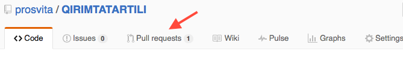
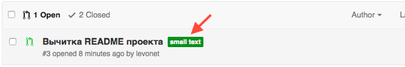
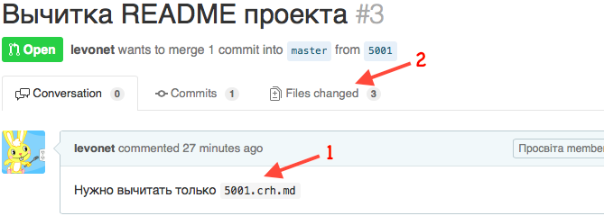
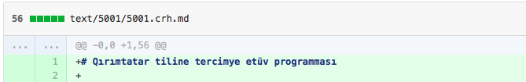
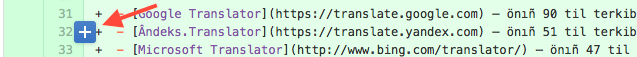
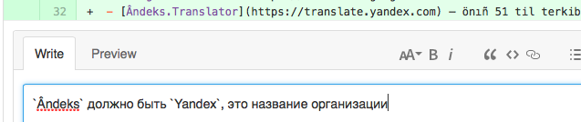
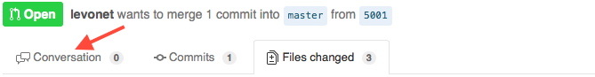

## Как помочь

### Проверка текстов

После сканирования и оцифровки книг на крымскотатарском или перевода текста с кирилицы на латиницу в текстах появляется большое количество механических ошибок. Чаще всего это:

  - неправильно распознанные буквы
  - неправильно сконвертированные названия городов или имена

Чтоб помочь исправить эти ошибки воспользуйтесь инструкцией:

1. Зарегестрируйтесь на [GitHub](https://github.com/join)
2. Зайдите в раздел [Pull Requests](https://github.com/prosvita/QIRIMTATARTILI/pulls) по ссылке.  
   Так же можно перейти в этот раздел из любой точки проекта
   [QIRIMTATARTILI](https://github.com/prosvita/QIRIMTATARTILI), как показано на изображении:  
   
3. Выберите текст для вычитки по метке по своим силам и перейти к нему  
   
   - `small text` — короткий текст (фраза или короткая статья)
   - `middle text` — средний текст (статья или небольшой рассказ)
   - `large text` — длинный текст (несколько глав книги или книга целиком)
4. В задании указано, что нужно сделать `(1)`,  
   после чего перейдите к документам для вычитки `(2)`  
   
5. Документы состоят из имени (например `5001`) и расширения (например `crh.md`).
     
   Расширения означают, что документ:
   - `crh.md` — латиницей на крымскотатарском языке
   - `cyr.md` — кирилицей на крымскотатарском языке
   - `ru.md` — на русском языке
6. Вычитайте текст. Если Вы обнаружили ошибку — добавьте комментарий к строчке:
   - нажмите на `+` на против необходимой строчки
     
   - оставьте комментарий о найденой ошибке и нажмите кнопку `Comment`
     
7. После завершения вычитки, вернитесь к описанию задания
     
   и оставьте комментарий:
   - `:ok:` — если ошибок не нашли
   - `Вычитал, есть замечания` — если они есть
8. Переходите к пункту `2.`
